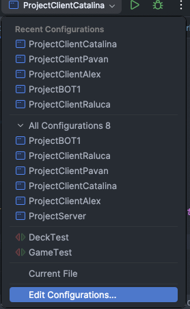
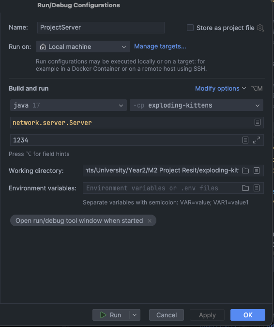
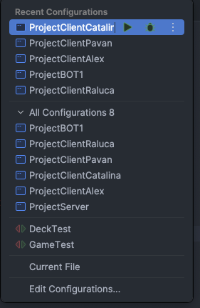
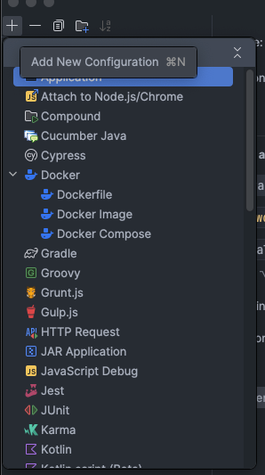
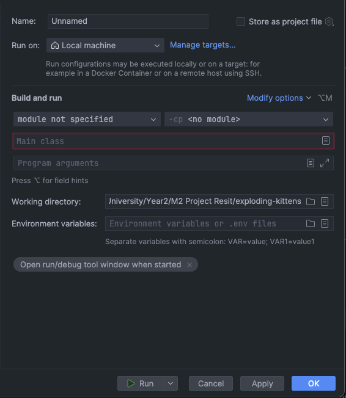
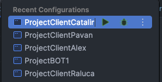

# EXPLODING KITTENS

## Culda Alexandru Dan | s3022684
## M2 P-Project 2023-2024

Thank you for your time (in advance). The project is structured in two major folders, the <b>local</b> one and the
<b>network</b>. Both are sub-structured into an MVC pattern, but the <b>local</b> was used initially, when I
developed the game without the network pattern. The <b>local</b> varies a lot, as it was abandoned in an early
stage (I moved onto the network folder before finishing the TUI & Game logic).

Nevertheless, for the final submission, everything will be done in the <b>network</b> folder.

Thus, if you want to start the project, you will start only the Server and Client. Nothing less, nothing more.

### STARTING A SERVER
Before starting a client, you must first start a server. For you to do this, go into the **src.network.server.Server**
file. Here, go into the up right corner under configuration and press ```Edit configurations...```.



On the new window that popped up, press ```+``` and ```Applications```. A new window will appear:



This is how a current configuration should look like.

Under: <br>
- Name
  - Name it however you'd like. <br>
- Module not specified
  - Java 17. My project is on Java 17. <br>
- cp
  - exploding-kittens <br>
- Main class
  - network.server.Server, because we are starting a Server <br>
- Program arguments
- The format is <port> <br>

I advise you to start the server on ```port 1234```. The port is not something hardcoded. The server takes it
from whatever ```main``` receives as Args. But ```1234``` is tested and known to work. I used throughout the
project.


### STARTING A CLIENT
For you to start a client, go into the **src.network.client.Client**. Here, you
will need to make some run configurations, because a Client is configuration
based on the arguments that the ```main``` function receives, not by asking the user in the terminal. Nevertheless,
at this point you should in the up-right corner and make a new configuration.



Press on _Edit configurations_.

In the new window, press the plus in the top right corner, followed by the _Application_ menu

.

Here, you will be presented with this window:




Under: <br>
- Name
  - Name it however you'd like. <br>
- Module not specified
  - Java 17. My project is on Java 17. <br>
- cp
  - exploding-kittens <br>
- Main class
  - network.Client, because we are starting a Client <br>
- Program arguments
  - **Very Important** The format is <Client's name> <"localhost"> <1234> <true/false> <br>

The first argument is the name of the player that will participate in the game.
The second argument should be ```localhost```, because we are connecting to the localhost. Of course, in the tournament
or other instances, this would be another local ip.
The third argument is the port, which **MUST BE ```1234```**. This is where the server is listening.
The fourth argument is a boolean ```true``` or ```false```, specifying if this current player is a bot or
human player. ```true``` stands for this client being a Computer. ```false``` stands for this client being a human.
My recommendation would be to make as many human players as possible, mainly because with bot you cannot
test my functionalities (not all of them at least). Click _Apply_ and that's it.

Make sure to start between 2 and 5 clients.

In the end, a correct configuration of a Client must look something along of:


---
As a final note, this is how my configurations looked like throughout doing & testing the project:



I used 4 normal clients and 1 bot. Of course, there were some variations, such as 2 human clients, 1 normal and 1 bot,
2 humans and 1 bot etc. In the picture there isn't the Server configuration, but I assure you I had one :).